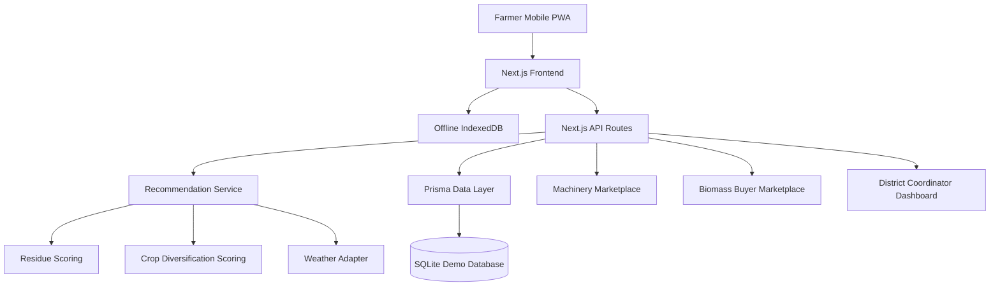

# Parali-to-Prosper

Parali-to-Prosper is a hackathon MVP for Punjab-focused agricultural residue management. The app helps farmers turn paddy stubble into income, reduce burning, and compare crop and water decisions.

## Punjab problem context

Punjab farms face a paddy stubble challenge every harvest season. This demo platform connects farmers with machinery, biomass buyers, and data-driven residue recommendations while keeping early offline support and multilingual access in mind.

## Features

- Farmer onboarding for farmland and residue tracking.
- Residue management recommendations and planning.
- Machinery discovery and booking workflow.
- Biomass buyer marketplace and residue listing.
- Crop diversification and water-use comparison.
- District coordinator metrics and risk mapping.
- Offline-ready PWA shell and local storage.
- English, Punjabi and Hindi translation support.

## Architecture



## Folder structure

- `app/` — Next.js App Router pages and routes.
- `components/` — Shared UI components and layout helpers.
- `lib/` — Services, calculations, adapters and offline helpers.
- `prisma/` — Database schema and seed data.
- `public/` — PWA assets and icons.
- `tests/` — Unit and end-to-end tests.

## Local setup

1. Copy `.env.example` to `.env`.
2. Run `npm install`.
3. Run `npx prisma db push`.
4. Run `npm run db:seed`.
5. Run `npm run dev`.

## GitHub Codespaces setup

1. Open this repository in Codespaces.
2. Wait for dependencies to install automatically.
3. Start the app with `npm run dev`.
4. Access the app on port `3000`.

## Environment variables

- `DATABASE_URL` — SQLite file path.
- `NEXT_PUBLIC_APP_NAME` — Public app name.
- `NEXT_PUBLIC_DEFAULT_LANGUAGE` — Default language code.
- `NEXT_PUBLIC_PILOT_REGION` — Pilot region label.

## Database setup

```bash
npx prisma db push
npm run db:seed
```

## Demo user flows

1. Enter as Farmer.
2. Select Patiala, Punjab.
3. Create a 5-acre paddy farm.
4. Enter a recent harvest date.
5. Generate a residue estimate.
6. Open “Manage my residue”.
7. Show three options: Book machinery, Sell residue, Retain residue.
8. Select the recommended machinery option.
9. Book a machine.
10. Open “Compare next crops”.
11. Show paddy versus maize or pulses.
12. Switch to Punjabi.
13. Enable simulated offline mode.
14. Open the saved recommendation.
15. Switch to District Coordinator.
16. Show the impact dashboard and machinery shortage map.

## Offline functionality

The app is designed to support offline-first usage with a PWA shell and local IndexedDB storage for profile and recommendation data.

## Recommendation logic

Recommendation results are generated using prototype scoring logic based on residue quantity, farm area, machinery availability, buyer offers, weather, and farmer priorities.

## Testing commands

- `npm run dev`
- `npm run build`
- `npm run lint`
- `npm run typecheck`
- `npm run test`
- `npm run test:e2e`
- `npm run db:seed`

## Future improvements

- Add real authentication and role-based access.
- Connect to live weather and market price APIs.
- Add real mapping and district-level geospatial data.
- Improve offline queue synchronization.
- Add more Punjabi and Hindi locale polish.

## Limitations and prototype disclaimer

This application uses realistic demo data and prototype estimates. Verify prices, machinery availability and agronomic advice locally before acting.

## Deployment

Recommended: deploy with Vercel (GitHub integration).

1. Connect this repository to Vercel via the Vercel dashboard (https://vercel.com).
2. In the Vercel project settings add the following Environment Variables in the same scope as your deployment (Preview/Production):
    - `DATABASE_URL` — use a hosted database (Postgres) for production; SQLite is only for demos.
    - `NEXT_PUBLIC_APP_NAME`
    - `NEXT_PUBLIC_DEFAULT_LANGUAGE`
    - `NEXT_PUBLIC_PILOT_REGION`
3. Optionally add secrets required by GitHub Actions:
    - `VERCEL_TOKEN` — Personal token from Vercel.
    - `VERCEL_ORG_ID` and `VERCEL_PROJECT_ID` — available from Vercel project settings.

Manual CLI deploy:

```bash
npm i -g vercel
vercel login
vercel --prod
```

CI deploy (GitHub Action): the repository includes `.github/workflows/deploy-vercel.yml` which deploys `main` to Vercel when the required secrets are configured.

Notes:
- For production, use a hosted Postgres or MySQL database and set `DATABASE_URL` accordingly. Vercel's ephemeral filesystem cannot persist SQLite files between deployments.
- After adding secrets, trigger a deployment by pushing to `main` or via the Vercel dashboard.
